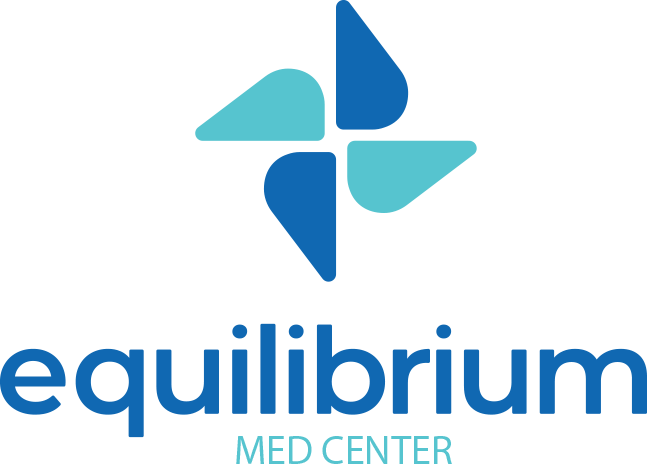
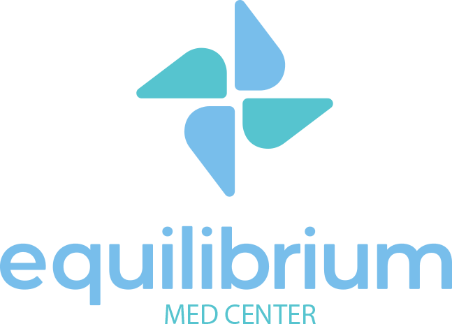

Padrão Equilibrium de Excelência

Este é o acervo normativo único do Grupo Equilibrium. Todo documento publicado aqui é **versão vigente**. Documento que não está aqui não está em vigor.

O PEE se organiza em seis cadernos, separados por **quando** cada um é usado.

[**0 · Marca e promessa**O que a Equilibrium é. Consulta pontual.](0-marca/index.md)
[**1 · Implantação**Abertura de unidade. Uma vez.](1-implantacao/index.md)
[**2 · Operação**A jornada do paciente. Uso diário.](2-operacao/index.md)
[**3 · Gestão**Faturamento, indicadores, pessoas. Mensal.](3-gestao/index.md)
[**4 · Controle**Auditoria e conformidade. Trimestral.](4-controle/index.md)
[**5 · Formação**Trilhas e certificação. Na admissão.](5-formacao/index.md)

## Como usar

| Se você precisa… | Vá para |
|---|---|
| Executar uma tarefa passo a passo | **Caderno 2 — Operação** |
| Saber o que nunca pode ser feito | **Caderno 0** → Carta de Inegociáveis |
| Entender se uma regra é obrigatória | **Caderno 0** → Níveis de Exigência |
| Saber qual documento existe e sua versão | **Caderno 4** → Lista Mestra |
| Propor mudança em um documento | **Caderno 4** → PEE-4-001 |

> **Busca.** O campo no topo cobre todo o acervo — quase sempre mais rápido que navegar pelo menu.

## Níveis de exigência

Todo documento declara seu nível no cabeçalho:

- **PADRÃO** — idêntico em toda unidade, sem exceção
- **DIRETRIZ** — o resultado é obrigatório, o método é livre
- **RECOMENDAÇÃO** — boa prática, adaptável

!!! danger "Nunca publique aqui"
    Dado identificável de paciente, credencial de acesso ou documento pessoal de colaborador. O histórico deste repositório é permanente.

Equilibrium Med Center LTDA · CNPJ 34.032.586/0001-98
Av. Cesário Alvim, 2011 — Uberlândia/MG
Documento de circulação interna. Reprodução externa não autorizada.

